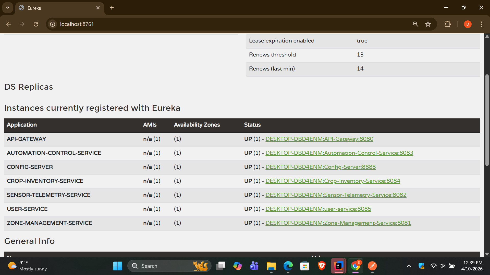

# 🌱Automated Greenhouse Management System (AGMS)

## **Project Overview**

This project is a Microservices-based Automated Greenhouse Management System developed using Spring Boot & Spring Cloud.
It manages greenhouse zones, sensor data, automation rules, and crop inventory.

## Architecture Overview

The system consists of:

🔹 Infrastructure Services
Service Registry (Eureka Server)
Config Server
API Gateway

🔹 Domain Microservices
Zone Management Service (Port: 8081)
Sensor Telemetry Service (Port: 8082)
Automation & Control Service (Port: 8083)
Crop Inventory Service (Port: 8084)

## Prerequisites

Before running the project, ensure you have:

Java 17+

Maven

Git

Postman

PostgreSQL

## How to Run the System (Step-by-Step)

✅ Step 1: Start Config Server
Runs on: http://localhost:8888
Provides centralized configuration for all services

✅ Step 2: Start Eureka Server (Service Registry)
Dashboard: http://localhost:8761
All services must register here

✅ Step 3: Start API Gateway
Runs on: http://localhost:8080
Handles routing and JWT security

✅ Step 4: Start Domain Services

Start services one by one:

🔸 Zone Management Service

Runs on: http://localhost:8081

🔸 Sensor Telemetry Service

Runs on: http://localhost:8082

🔸 Automation Service

Runs on: http://localhost:8083

🔸 Crop Inventory Service

Runs on: http://localhost:8084

🔸 User Service

Runs on: http://localhost:8085

## External IoT API Integration

Base URL:

http://104.211.95.241:8080/api

🔹 Steps

Register IoT user (Postman)

POST /auth/register

Login

POST /auth/login

Create device

POST /devices

🔄 Zone Creation Flow

When creating a zone:

POST /api/zones

Internal Process

Validate temperature range

Call IoT API (login)

Get access token

Register device

Save zone with deviceId

## Security
JWT Authentication implemented at API Gateway

All requests must include:

Authorization: Bearer <token>

# Eureka Dashboard

